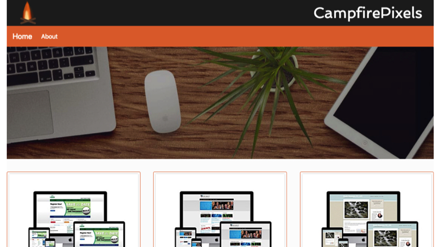

# Google Front-End Web Developer Nanodegree Portfolio Project
This project is to demonstrate the ability of the student to have 
basic web development skills.


It was built with the following tools:
   Bootstrap 4
   Gulp
   Sass
   



## Installation

OS X & Linux:

```sh
git clone git@github.com:Danny-G-Smith/readme-template.git
npm install

```

Windows:

```sh
You are on your own
```


[https://github.com/Danny-G-Smith/readme-template](https://github.com/Danny-G-Smith/readme-template)

